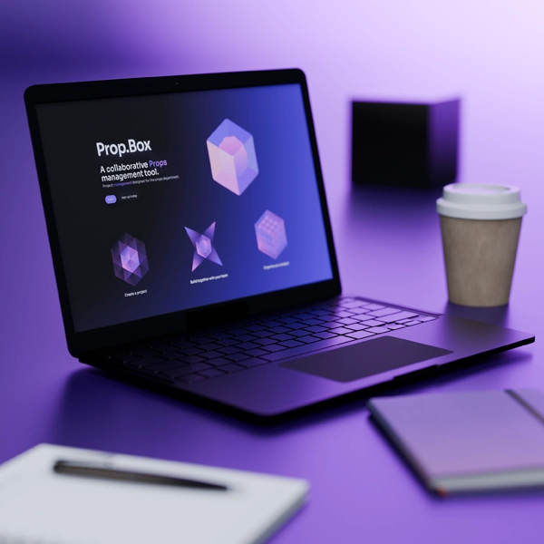
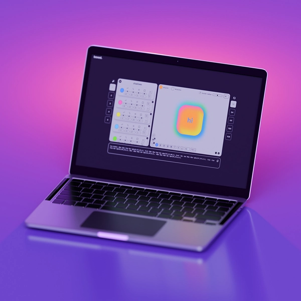

# Ryan Milbourne

I’m a front-end web developer and designer with over 16 years of experience in visual communication, specializing in crafting clear, effective designs and web solutions.

I am passionate about building engaging digital experiences that connect with audiences and elevate projects to new heights.

## 🤖 Skills

JS / HTML / CSS / React JS / Vite / Node.js / PostgreSQL / Adobe Suite / Webflow / Rive / GSAP

## 🖥️ Examples

  
  
  
  

