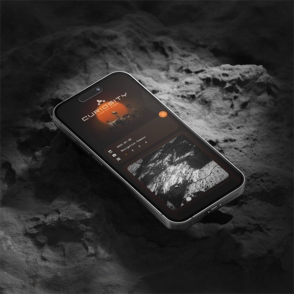

# Ryan Milbourne

I’m a front-end web developer and designer with over 16 years of experience in visual communication, specializing in crafting clear, effective designs and web solutions.

I am passionate about building engaging digital experiences that connect with audiences and elevate projects to new heights.

## 🧑🏽‍💻 Tech Stack

JS / HTML / CSS / React JS / Vite / Node.js / Supabase / PostgreSQL / Adobe Suite / Webflow / Rive / GSAP

## 🫠 Portfolio

Check out my portfolio: [ryanmilbourne.dev](https://ryanmilbourne.dev)

## 👀 Examples

  
  
  
  
  
  

